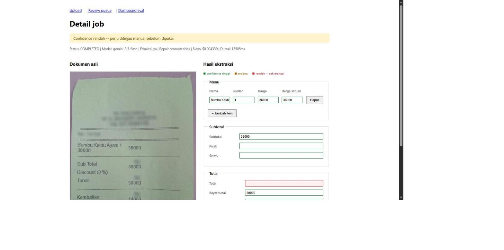

# Rinci



Backend service yang menerima dokumen bisnis berantakan (struk, nota,
faktur — foto miring, hasil scan buram) lalu mengembalikan data
terstruktur tervalidasi, plus antrean review buat field yang model
tidak yakin.

Nama **Rinci** dari kata "merinci" — memecah sesuatu jadi item-item
detail.

## Hasil eval (nyata, bukan estimasi)

20 sampel dari split `test` CORD-v2, model `gemini-3.5-flash-lite`.

| Field | Match | Akurasi |
|---|---|---|
| menu[].cnt | 34/35 | 97.1% |
| menu[].nm | 36/41 | 87.8% |
| menu[].price | 36/39 | 92.3% |
| menu[].unitprice | 3/8 | 37.5% |
| sub_total.service_price | 1/1 | 100.0% |
| sub_total.subtotal_price | 13/14 | 92.9% |
| sub_total.tax_price | 8/8 | 100.0% |
| total.cashprice | 13/15 | 86.7% |
| total.changeprice | 11/12 | 91.7% |
| total.total_price | 18/19 | 94.7% |
| **OVERALL** | **173/192** | **90.1%** |

`menu[].unitprice` paling rendah — banyak struk tidak mencantumkan
harga satuan eksplisit, model kadang menebak. Lihat
`docs/notes/tahap-0-hasil.md` buat analisis awal per-field.

**Biaya per dokumen** (tarif berbayar resmi Gemini API, dicek
2026-09-02 — project ini jalan di **free tier**, biaya riil Rp0):
- Model murah saja: **$0.000959/dokumen**
- Dengan routing (eskalasi ke model lebih mahal saat confidence
  rendah): **$0.001728/dokumen** — **80.2% lebih mahal**, TANPA
  perbaikan akurasi keseluruhan (90.1% → 90.1%) di sample ini. Temuan
  jujur, bukan yang diharapkan — detail di `docs/notes/tahap-5-hasil.md`.

**Latensi ekstraksi ujung-ke-ujung** (k6, submit sampai job
`COMPLETED`, lihat `docs/notes/tahap-7-load-test.md`):
- p50: 3.05s · p90: 11.16s · **p95: 12.18s**
- Latensi HTTP murni (`POST /extract`/`GET /jobs/:id`): p95 44ms — jauh
  lebih kecil, karena ekstraksi jalan async di worker (Tahap 2), klien
  tidak nunggu di dalam siklus request/response.

## Coba sendiri

```bash
npm install
cp .env.example .env   # isi GEMINI_API_KEY, DATABASE_URL, REDIS_URL
npx prisma migrate dev
npm run build
npm run dev             # terminal 1: API di :3000
npm run worker           # terminal 2: worker
```

Buka `http://localhost:3000` — ada 3 contoh struk siap pakai kalau
tidak punya struk sendiri (link di halaman upload). Dokumentasi API
interaktif di `http://localhost:3000/api-docs`, metrics Prometheus di
`/metrics`.

## Arsitektur singkat

```
Upload → validasi magic-byte → antre (BullMQ/Redis) → 202 + jobId
                                        ↓
Worker terpisah → panggil Gemini → validasi skema (repair kalau gagal)
                → skor confidence → simpan hasil (Postgres)
                                        ↓
                          GET /jobs/:id (polling)
```

- **Provider-agnostic**: `ExtractionProvider` interface, adapter Gemini
  dipakai sekarang — gampang tambah adapter lain.
- **Idempotency**: hash isi file, upload identik tidak diproses ulang.
- **Retry + dead-letter queue**: 3 attempts exponential backoff di
  level job, di atas retry transient di level provider. Job yang gagal
  total tetap bisa diperiksa (`GET /jobs/dead-letter`).
- **Confidence heuristik** (bukan dari model — Gemini API yang dipakai
  tidak expose logprob): null-check + validasi aritmetika
  (`subtotal+pajak` vs `total`, `cnt×unitprice` vs `price`).
- **Review queue**: koreksi manusia otomatis jadi sampel eval baru
  (`data/cord/corrections/`).

Keputusan arsitektur lengkap ada di `docs/adr/` (satu file pendek per
keputusan, termasuk kenapa Docker Compose diganti hosted gratis, kenapa
web app dibangun manual bukan pakai Claude Design, dan lain-lain).

## Dataset

**CORD-v2** (NAVER Clova AI), lisensi **CC BY 4.0**. Sampel demo di
`public/samples/` dan seluruh eval set diambil dari dataset ini.
`store_info`/`payment_info` sengaja tidak diekstrak — dihapus dari
rilis publik CORD karena regulasi privasi.

## Stack

NestJS + TypeScript, Prisma (Postgres, hosted di Neon), BullMQ (Redis,
hosted di Upstash), Zod, Gemini API. CI (`npm run eval` tiap PR) pakai
Postgres/Redis sebagai service container GitHub Actions (bukan
Neon/Upstash asli). Detail: `CLAUDE.md` dan `docs/adr/`.
